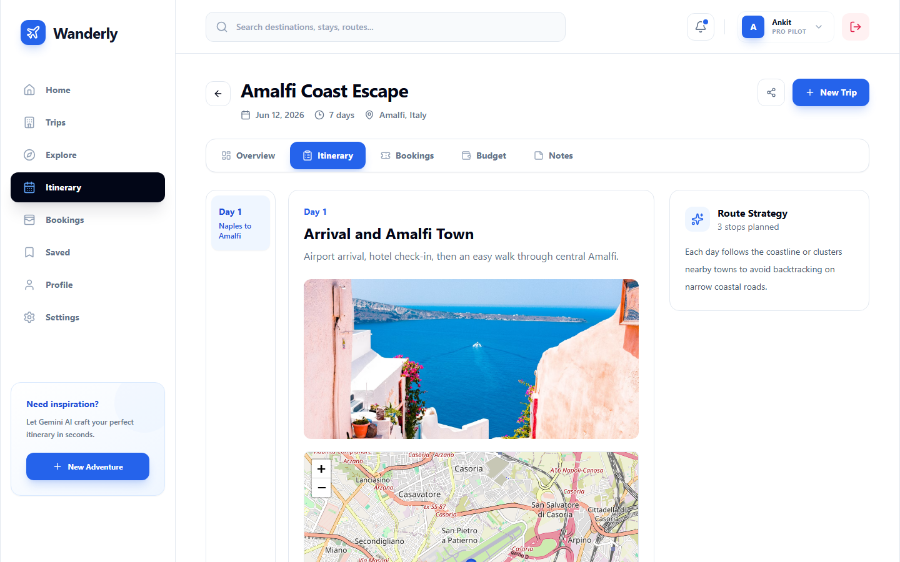
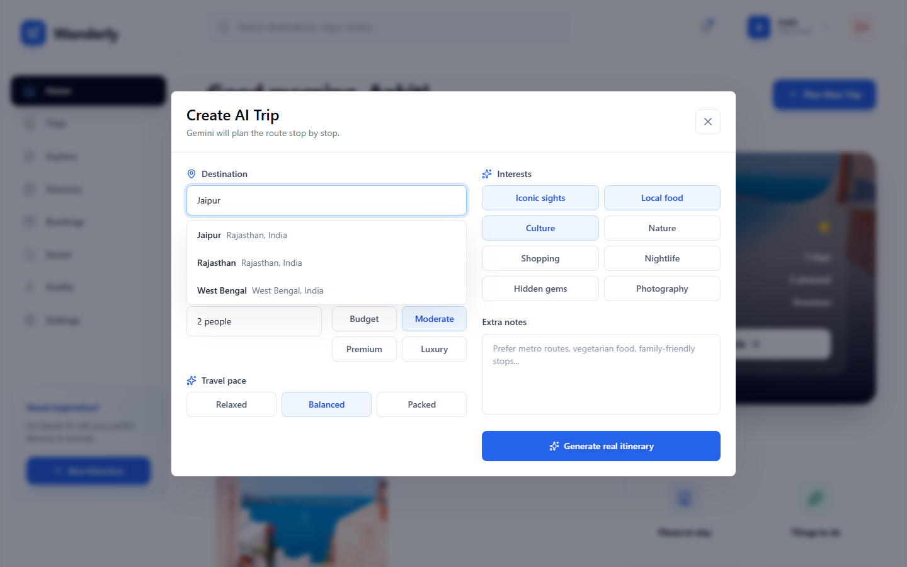
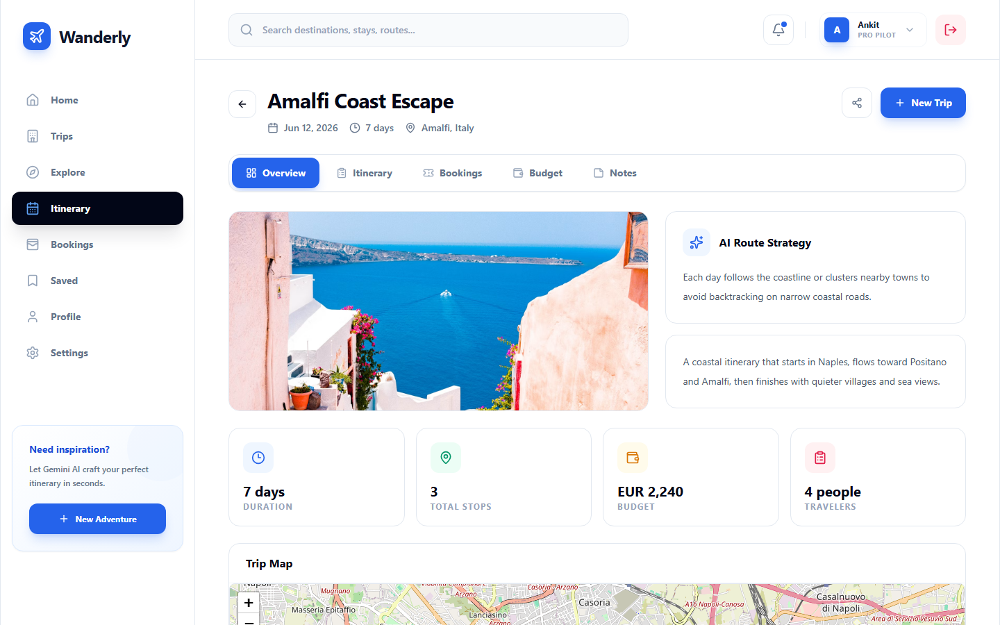

# Wanderly

[](https://github.com/ankitsingathia/tripplanner/actions/workflows/ci.yml)
[](LICENSE)

An AI trip planner. You give it a destination and a few constraints, and it
returns a day-by-day itinerary built from real OpenStreetMap places, in a
sensible order, drawn on a map and saved to your account.

**[Try the live app](https://tripplanner-jtno.onrender.com).** You don't need
to sign up: the login screen has a demo mode that runs the full planner and
keeps trips in browser storage. It's on Render's free tier, so the first load
after it has been idle can take about 30 seconds.



| Planning a trip | Trip overview |
| --- | --- |
|  |  |

---

## Why I built it this way

Itineraries straight from an LLM often look fine but don't work on the ground.
Day two sends you across the city and back, some places have closed, and
nothing has coordinates, so you can't check any of it.

So the model doesn't get to pick places from memory. Before calling it, the
server looks up the destination's coordinates and fetches the real attractions,
hotels, cafés and restaurants within 5 km from OpenStreetMap. That list goes
into the prompt, and the model's job is to choose from it and put the stops in
order. Every stop comes back with a latitude and longitude, so the route is
drawn on a map and a wrong location is easy to spot.

## How a trip gets built

1. **Destination lookup.** Typing calls `/api/search`, which proxies Nominatim.
   Input is debounced by 250 ms and older in-flight requests are cancelled.
2. **Nearby places.** Picking a suggestion sends an Overpass query for
   attractions, hotels, restaurants and cafés within 5 km. The results are
   cleaned up and capped at 30 named places with valid coordinates.
3. **Prompt.** The trip settings (dates, length, budget, travellers, pace,
   interests, notes) and up to 20 of those places go into one prompt, with
   rules: group each day by area, give the travel time from the previous stop,
   respect likely opening hours, and stay within budget.
4. **Generation.** Gemini 2.5 Flash, with `responseMimeType: application/json`
   and thinking turned off (`thinkingBudget: 0`), because thinking adds a long
   wait before a big reply starts. The model still sometimes wraps its JSON in
   markdown fences or extra text, so a fallback parser strips those and slices
   out the outermost braces.
5. **Normalisation.** `normalizeTrip()` gives every field a default. A reply
   with no `routeStrategy`, or with half the stop details missing, still
   renders instead of crashing.
6. **Render.** Each day gets a Leaflet map: numbered markers on the stops in
   order, a line through the route, and the other nearby places in grey.

## Design decisions

**Map lookups have a time limit and are shared.** Overpass is run by
volunteers and can be slow. In testing it answered in about 4 s when
it worked, and hung for 11-13 s before returning a 504 when it didn't. Trip
generation has to wait for it before Gemini is called. Now Overpass gives up
after 8 s and Nominatim after 5 s. The map data is best-effort, so a timeout
means a less grounded plan, not a failed one. Results are cached in cells of
about 110 m. The preview (sent when you pick a destination) and the Generate
request share one lookup. Before that change, a failed preview made Generate
wait through a second slow lookup, 8.2 s of it.

**A bad model reply is a 502, not a crash.** If a reply has no JSON, or has
braces around broken JSON, the API reports that it could not be parsed instead
of throwing a parser error.

**One process in both modes.** In development, Express runs Vite as middleware
for hot reload. In production it serves `dist/` and falls back to `index.html`
for any GET that isn't an API route, while unknown `/api` routes still return
404. It's one entry point and one service to deploy.

**The map doesn't take over scrolling.** Scrolling the mouse wheel over a map
scrolls the page. Only a pinch zooms the map. The map also has its own stacking
context, so Leaflet's z-indexes can't draw it over the sticky header.

## Stack

| Layer | Choice | Why |
| --- | --- | --- |
| UI | React 19, Vite 7, Tailwind CSS | Fast dev loop, and utility classes keep many views looking consistent |
| Server | Express 5 (Node 18+) | Keeps API keys on the server and serves the app from the same process |
| Model | Google Gemini 2.5 Flash | Has a JSON output mode and is cheap enough to regenerate plans freely |
| Geo | Nominatim, Overpass, Leaflet, OpenStreetMap tiles | No API keys, quotas or per-map billing |
| Auth & data | Firebase Auth (Google), Cloud Firestore | Security rules scoped to the owner, so no session layer to write |
| Tests | Vitest, GitHub Actions | Tests, lint and a production build on every push |

## Project layout

```
server/
  index.js        Starts listening on the port, nothing else
  app.js          Middleware order: JSON body → /api → frontend → errors
  config/         Every environment variable, read once
  routes/         URL → controller table
  controllers/    HTTP in and out, no business logic
  services/       Trip orchestration, Gemini client, OpenStreetMap client and cache
  domain/         Prompt, trip normaliser, fallback photos
  lib/            HttpError, JSON extraction from model replies
  middleware/     Errors → JSON; Vite in dev, static files in prod
src/
  App.jsx         Auth state, trip state, view routing
  components/     TripCreator, TripDetail, TripMap, Dashboard, Explore, Profile, Shell
  services/       Firebase, and one tripStore interface over Firestore and localStorage
test/server/      API and server tests
firestore.rules   Access rules scoped to the owner
```

Changing the model provider means editing `services/gemini.service.js`.
Changing the image source means editing `domain/photos.js`. A new endpoint is
one line in `routes/` plus a controller.

## API

| Endpoint | Purpose |
| --- | --- |
| `GET /api/health` | Whether a Gemini key is set and which geo providers are used. Never returns the key |
| `GET /api/search?input=` | Nominatim autocomplete: place id, label, coordinates, type |
| `GET /api/nearby?lat=&lon=` | Overpass search around a point |
| `POST /api/generate-trip` | The planner. Looks up the destination and nearby places if the client hasn't, then generates and normalises |
| `GET /api/place-image?query=` | Hero image, picked the same way every time for a given destination |

`/api/generate-trip` needs `destination`, `durationDays` and `budget`. The
other fields are optional and change the prompt.

## Tests

```bash
npm test
```

29 tests that run in about two seconds with no API key and no network, because
every outbound call is stubbed. They cover the parts most likely to break
without anyone noticing:

- pulling JSON out of messy model replies
- filling in anything the model leaves out
- sharing one Overpass lookup between preview and submit, including when it fails
- the shape of the Gemini request
- the API's input validation and 404s

CI runs lint, the tests and a production build on every push. The tests cover
the server only. The React side is still checked by hand.

## Running locally

Needs Node 18 or newer.

```bash
git clone https://github.com/ankitsingathia/tripplanner.git
cd tripplanner
npm install
cp .env.example .env    # then add your GEMINI_API_KEY
npm run dev
```

Open http://localhost:5173. [`.env.example`](.env.example) lists every setting
with a note on each. Only `GEMINI_API_KEY` is needed to generate trips.

Set `OSM_USER_AGENT` to something that identifies your build. Nominatim and
Overpass are run by volunteers and will rate-limit or block anonymous traffic.

Firebase is optional. If any Firebase key is missing, the app starts in demo
mode instead of failing, and trips are saved to `localStorage` through the same
`tripStore` interface the Firestore path uses. The UI doesn't know which one
it's using.

## Deployment

Deployed on Render as a single web service:

- **Build:** `npm install && npm run build`
- **Start:** `NODE_ENV=production node server/index.js`
- **Environment:** the variables from `.env.example`. The server listens on `process.env.PORT`.

`NODE_ENV=production` is what makes Express serve the built files instead of
starting Vite.

## Data and persistence

Signed-in users' trips are stored at `users/{uid}/trips/{tripId}`. The rules
in `firestore.rules` only allow a read or write when `request.auth.uid == userId`,
on both the profile document and the trips, so a signed-in user can't read
someone else's data by guessing their uid.

## What is and isn't real

**Plan, Trips and Itinerary are the working product:** live geocoding, live
place data, real generation and real saving. **Explore, Bookings and Saved show
fixed sample data.** They are finished screens for features that would need a
booking or inventory service behind them.

Hero images come from a small fixed set, picked by destination name, not from
an image search API. The geo cache lives in memory, which works for one server
but would need a shared cache for several.

## License

[MIT](LICENSE)
